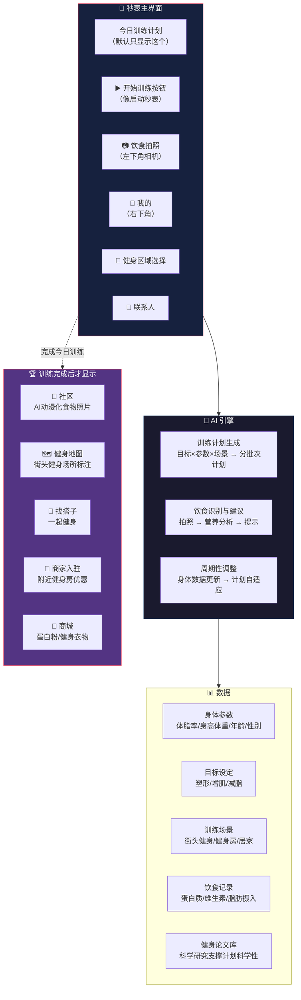

# AI 健身教练 · 秒表级极简 App

## 💡 Core Idea
像秒表一样简单的 AI 健身教练——打开即用，根据身体参数和训练目标智能生成分批次训练计划，拍照识别饮食，周期性调整方案。核心解决一个问题：**坚持不下去**。界面极简到只剩一个「开始」按钮，社交功能只有完成训练后才解锁。

## 🌱 Context / Trigger
少主自己健身但一直坚持不下去。之前用 Google 模型直接生成了前端原型，加入了大模型 API 实现了智能计划生成。现想确定整体框架。

## 🏗 系统框架图

## 📝 核心功能

### ⏱️ 秒表主界面
- 打开 App 就是一个计时器 + 今日训练计划
- 点击「开始」→ 显示动作列表（如「卷腹 3 组 × 15 次」）
- 左下角相机按钮记录饮食，右下角「我的」
- **训练完成前，其他功能不显示**——降低干扰，专注执行

### 🧠 AI 训练计划
- 输入：体脂率、身高体重、年龄、性别、目标（塑形/增肌/减脂）、场景（街头/健身房/居家）
- 按肌群分批次安排（胸/背/腿/肩臂/核心，每日不同组合）
- 基于健身论文和科研数据科学制定
- 周期性重新填写身体报告 → 自动调整计划

### 📷 饮食识别
- 拍照自动识别食物
- 分析蛋白质/维生素/脂肪等营养摄入
- 提示补充或控制某类食物
- 饮食记录可 AI 动漫化后发社区（保护隐私）

### 🔄 周期调整
- 每 N 天/周填写一次身体参数更新
- AI 对比前后数据，自动调整训练强度和动作组合

### 📸 训练后加油打气
- 完成相同动作后，可自拍短视频/照片给别人加油
- 比如「卷腹完成，你也加油💪」——配自拍或训练数据截图
- 别人可以点赞、关注
- 轻量社交，不搞复杂动态流，就是打完卡互相喊一声加油

### 🏆 训练完成后解锁
- 🗺️ 健身地图：标注街头健身场所、公园单杠、露天器械
- 🤝 找搭子：匹配附近同目标的健身伙伴
- 🏪 商家入驻：附近健身房优惠、体验课推荐
- 🛒 商城：蛋白粉、健身衣物、器材
- 📝 社区：AI 动漫化的饮食记录 + 训练成果分享

## 🌍 同类/竞品扫描

> Scanned on 2026-07-05

| 项目/产品 | 地区 | 类型 | 一句话 | 与我的区别 |
|-----------|------|------|--------|-----------|
| FitAI | 🇨🇳 | App | AI 个性化训练 + 3000+ 动作库 | 传统健身 App 形态，功能堆叠，无异步解锁 |
| Freeletics | 🌍 | App | 老牌 AI 教练，口碑好 | 偏硬核 CrossFit 风格，界面不极简 |
| Impakt | 🌍 | App | AI 健身教练人格化 + 社交 | PH #1，但社交前置，不是训练后才解锁 |
| FitnessAI | 🌍 | App | AI 自动调整训练重量/组数 | 纯力量训练，无营养/社交/地图 |
| Simple | 🌍 | App | AI 减肥教练 + 营养分析 | 偏减肥，非通用健身 |
| Budy | 🌍 | App | 极简计时器 + AI 训练 | **最接近**——计时器切入，但没「训练前隐藏社交」的机制 |
| Keep | 🇨🇳 | App | 内容平台型健身 | 内容堆叠、社交喧闹，不极简 |
| MyFitnessPal | 🌍 | App | 饮食热量追踪 | 纯饮食，无训练计划 |

### 判断
**已验证赛道但可差异化。** AI 健身 App 已经很卷（FitAI、Freeletics、Impakt、FitnessAI 都有大量用户），但**没有一个用「秒表极简界面 + 训练完成才解锁社交」这个机制**。你的差异化不在于 AI 能力本身（大家都用 AI），而在于产品哲学：不是让用户花更多时间在 App 里，而是让用户花更少时间打开 App、更快开始训练。难点是「极简」和「AI 能力完整」之间的平衡——秒表界面上如何自然地塞进饮食拍照、计划调整这些功能而不破坏极简感，这个 UX 需要反复打磨。

## 用户调研
- 2026-08-03 深度报告：`~/Documents/Obsidian/projects/_research/fitness-planner-20260803.md`（正式项目 [[健身规划引擎]]）
- 相对 2026-07-05 浅扫描：补强「坚持失败」侧用户证据（onboarding、羞辱性数据、饮食摩擦、社交喧宾），差分仍成立。

## 🔗 Connections
- 已有原型：用 Google 模型生成过前端，接入了 LLM API
- 正式项目：[[健身规划引擎]] · 代码 `~/fitness-planner` · App `~/stopwatch`
- 可结合：天演项目（AI 多智能体）做训练效果预测
- 参考：Keep（内容）、MyFitnessPal（饮食）、Strava（社交激励）
